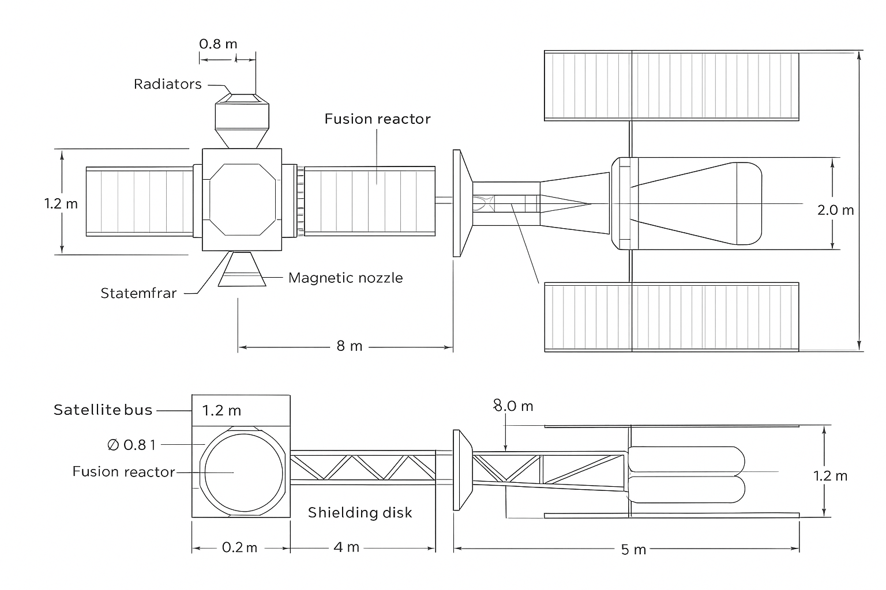

# Propulsive-thruster-design(FREECAD openSource Project)
Electric ion plasma with softer nuclear fusion. Possible idea or solution to the issue of propulsion in space or engines and thrusters. I thought of Magnetar hovering around dimensions or external dimensional fields of a large black hole. Another solution because the plasma or neutron pulsar would act in a unique way with the black hole, but if it were the other way around, a white hole would act by repulsion and not extreme gravitational attraction.

FreeCAD satellites integration,cubesats:https://www.freecad.org/
Mode 1 (Soft Cruise): Low-power, high-specific-impulse electric propulsion (ion/Hall/MPD/VASIMR) for extended maneuvers and fuel efficiency. It uses light propellant (H, H₂, or Xe/Ar depending on the system) with small but highly efficient thrusts (high Δv possible).

Mode 2 (Pulse Thrust): A controlled, pulsed fusion source that delivers bursts of high power when rapid acceleration is needed (escape from a gravity well, rapid insertion maneuver, transfer time reduction). This fusion would not be a "mini black hole" or anything exotic: it would be sustained or pulsed fusion (concepts like magnetic fusion, magnetized inertial confinement, pulsed fusion) coupled with a magnetic nozzle to convert energetic particles into directed thrust.

Central Power Plant: Orbital-sized fusion reactor mounted on the ship's axis. Pulsed operating mode for maneuvers and standby mode for low continuous electrical generation.
Propeller Docking: Magnetic nozzle with superconducting coils (generate a field to expand and direct plasma).
Auxiliary Subsystems: Supercapacitor banks for surges, deployable radiators, modular shielding (lightweight materials enriched with hydrogen layers to moderate neutrons).
Operating Mode: During cruise, use electric propulsion (low power). When high Δv is required, load banks and discharge into the pulsed fusion reactor -> commanded bursts of plasma through the nozzle.

Propellant: Hydrogen stored at low density or in the form of compact hydrides to reduce volume.
Compact fusion reactor (e.g., magnetic confinement or pulsed magneto-inertial): produces high-energy particles/energy.
Thrust converter/magnetic nozzle: deflects and channels hot plasma without material contact. Prevents thermal erosion.
Energy management systems: superconductors for magnetic fields, storage (ultracapacitor batteries or flywheels) to manage power peaks.
Radiation and shielding systems: fusion produces neutrons (depending on the reaction) shielding + sacrificial material; be careful with D-T.

Electric propulsion (ion / Hall / MPD / VASIMR) for continuous low-power operation when fusion is not active.
Plasma Containment and Fusion

Function: To confine plasma and withstand energy pulses without erosion or melting of the material.

Required Properties:

High temperature resistance (up to 10⁶ K in nearby plasma).

High thermal conductivity to evacuate heat.

Radiation resistance (neutrons and charged particles).

Compatibility with strong magnetic fields.

Materials and Structures:

Superconductors: NbTi, Nb₃Sn, YBCO (high current and magnetic fields).

Internal reactor linings: tungsten, beryllium, boron carbide, composite graphene.

Base structure: Reinforced stainless steel, Inconel, titanium alloys.

Quantized cells: Internal modular structures of reinforced aluminum or titanium to withstand mechanical loading without deformation.

Ground Testing:

Use of vacuum chambers to simulate space conditions.

Scaling: Reduced plasma pulse for confinement testing.

Active cooling with cryogenics or coolant (liquid He or liquid N₂).

 Magnetic nozzles and plasma guides

Function: Channel and direct plasma without physical contact.

Required properties:

Resistance to erosion by charged particles.

Low susceptibility to induced currents and magnetic fields.

Mechanical rigidity to maintain geometry.

Materials:

Superconducting alloys (NbTi) for coils.

Graphene or boron carbide inner liner (withstands hot plasma).

Support structure: high-strength aluminum or titanium.

Ground testing:

Can be simulated with low-density plasma and low voltages.

Use of vacuum chambers and plasma flow sensors.

 Cryogenic Cooling

Function: Absorb heat from fusion micropulses and keep superconductors functioning.

Required Properties:

Good heat flow, low coefficient of thermal expansion.

Compatible with cryogenic liquids (He, N₂).

Materials:

Copper or aluminum microchannels with insulating ceramic coating.

Graphene or synthetic diamond plates for high thermal conductivity.

Ground Testing:

Low-temperature liquid helium circulation.

Distributed temperature sensors for heat mapping and efficiency.

 Neutron/Radiation Shielding and Protection

Function: Protect structure and electronic equipment from neutrons and gamma radiation from fusion.

Required Properties:

Neutron moderation.

Resistance to radiation activation.

Lightweight to avoid compromising propulsion.

Materials:

Solid or composite hydrogen (reinforced polymers) to moderate neutrons.

Tungsten or beryllium for secondary radiation.

Graphene or carbon layers to dissipate heat.

Ground Tests:

Small-scale shielding with radiation simulators (X-ray and neutron generators).

 Mechanical Structures and Support

Function: Withstand weight, vibrations, and plasma expansion forces.

Required Properties:

High mechanical rigidity.

Low coefficient of thermal expansion.

Compatible with vacuum and extreme temperatures.

Materials:

Reinforced titanium and aluminum alloys.

Carbon fiber composites.

Modular internal supports for quantized cells.

Ground Tests:

Cells subject to vacuum and vibration chambers to simulate launch.

Thermal testing with resistors or microplasma.

 Specific Vacuum Considerations

Avoid oxidation: Use only stable metals and compounds.

Avoid outgassing: Seal with resins and adhesives.

Radiators: Use graphene or black aluminum panels for maximum radiant heat output.
